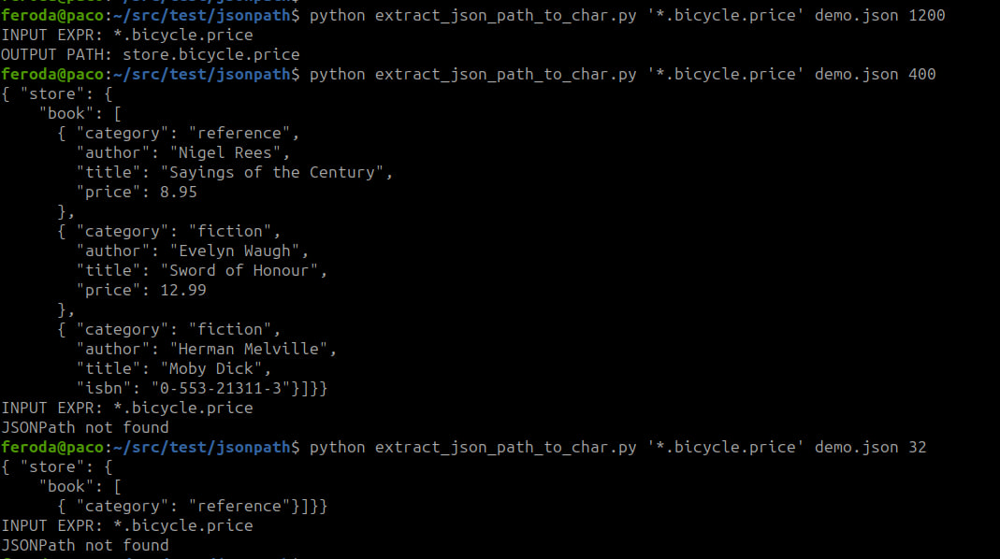
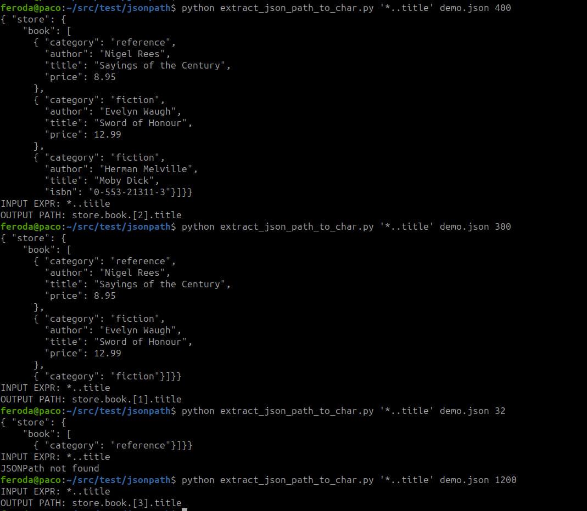

# Extract JSONpath To Char

Given a file, extract a JSONPath in whole file or in a subset

## Install requirements

`pip install -r requirements.txt`

## Usage Examples


```
python extract_json_path_to_char.py '*.bicycle.price' demo.json 1200
python extract_json_path_to_char.py '*.bicycle.price' demo.json 400
python extract_json_path_to_char.py '*.bicycle.price' demo.json 32
```

```
python extract_json_path_to_char.py '*..title' demo.json 400
python extract_json_path_to_char.py '*..title' demo.json 300
python extract_json_path_to_char.py '*..title' demo.json 32
python extract_json_path_to_char.py '*..title' demo.json 1200
```

## Results




